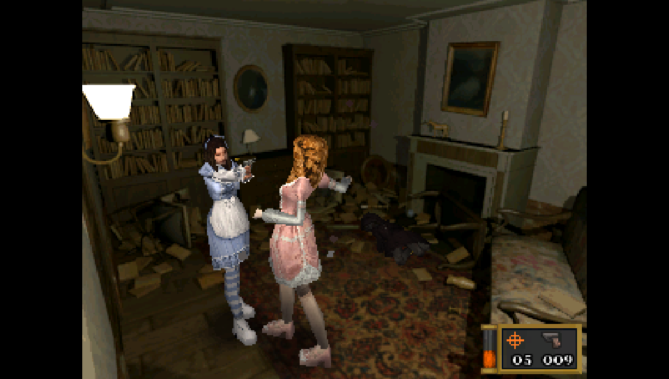

# Alisa Vita

This is a port of Alisa: Developer's Cut for PSVita.

Alisa is a indie survival horror game heavily inspired by the classics of this genre like the original Resident Evil.

# Note
- This patch works exclusively with the latest version of the game at the time of writing this README. If the game received a new update, the depot you want is: `download_depot 1335530 1335531 3838329713333394627`
- The "Special" button is mapped on L Trigger.

# Known issues

- Enemy AI is less aggressive and can sometimes get confused. This is the result of an heavy optimization in the pathfinding logic (planned to improve in future updates).
- After finishing a run, the video prior the main menu will stop working until app is rebooted.
- On new runs, sometimes the backpack on Alisa won't disappear after the prologue.
- The grab animation during the final boss is a bit glitchy (only visual).
- There are some minor issues with lighting across the game.

# How to Install

- Buy [Alisa: Director's Cut from Steam](https://store.steampowered.com/app/1335530/Alisa/) and install it.
- Download the `datafiles.zip` and `alisa.vpk` from the Release page.
- Install `alisa.vpk` on your PSVita.
- Extract on your PC `datafiles.zip` in a folder of your preference.
- From the Steam game datafiles, copy all files (excluding directories) from `Alisa_Data` folder except for `app.info` and `output_log.txt` (it should total at 289 files) to the `alisa` folder in the datafiles folder.
- Run `patch_files.bat`.
- Extract all the files, except for `archive.psarc`, inside the `alisa` folder inside the `data.zip` generated file into `ux0:app/ALSA50001/Media`.
- Extract `archive.psarc` inside the `alisa` folder inside the `data.zip` generated file into `ux0:app/ALSA50001`.
- **Optional**: For trophies to be unlockable, install [NoTrpDRM](https://github.com/Rinnegatamante/NoTrpDrm).

# Credits

- **PatnosD**: For fixing the vast majority of animations in the game and for giving additional help to fix some minor issues.
- **hatoving**: For helping with the initial bootstraping of the project and for the Livearea assets.
- **withLogic**: For additional help testing the port.
